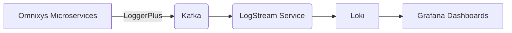

# 📝 GentleCorp Logging-Service

Ein modularer, sicherer und erweiterbarer Logging-Microservice für das GentleCorp-Ecosystem – mit:
- MongoDB (Persistenz)
- Kafka (Event-Streaming)
- FastAPI (REST & GraphQL APIs)
- Keycloak (Security)
- Dynamischem Multi-Channel Alerting (Discord, Mail, Webhook, SMS)

---

## 🚀 Features

✅ REST-Endpoint `POST /logs`
✅ GraphQL API `logs(...)`, `exportLogs(...)`
✅ Keycloak-Absicherung für Rollen wie `Admin`, `auditor`, `service-logger`
✅ Alerts bei kritischen Logs über:
- 💬 Discord Webhook
- 📧 E-Mail (SMTP)
- 📱 Webhook / SMS (erweiterbar)

✅ CLI zum Testen von Alerts:
```bash
python -m logging.tools.alert_cli test-all
```

---

## 🧱 Architektur

```
FastAPI
├── REST API /logs
├── GraphQL /graphql
├── Kafka Producer
├── Kafka Consumer + AlertService
└── MongoDB (Beanie ODM)
```

---

## ⚙️ .env-Konfiguration (Beispiel)

```env
# MongoDB
LOGGING_MONGODB_URI=mongodb://localhost:27017
LOGGING_MONGODB_DB_NAME=logging_service

# Keycloak
KC_SERVICE_HOST=localhost
KC_SERVICE_PORT=18080
KC_SERVICE_REALM=camunda-platform
KC_SERVICE_CLIENT_ID=camunda-identity
KC_SERVICE_SECRET=xxx

# Alerts dynamisch steuern
ALERT_DISCORD_ENABLED=true
ALERT_EMAIL_ENABLED=true
ALERT_WEBHOOK_ENABLED=false

# Discord
DISCORD_WEBHOOK_URL=https://discord.com/api/webhooks/...

# Mail
EMAIL_USER=alert@example.com
EMAIL_PASS=pass
EMAIL_FROM=alert@example.com
EMAIL_HOST=smtp.example.com
EMAIL_PORT=587
ALERT_EMAIL_TO=Admin@example.com

# Optionaler Webhook
ALERT_WEBHOOK_URL=https://api.partner.com/alert
```

---

## 🥪 Beispiele

### 📥 POST /logs

```http
POST /logs
Authorization: Bearer <JWT>
Content-Type: application/json

{
  "timestamp": "2025-04-17T13:15:00Z",
  "service": "payment-service",
  "level": "ERROR",
  "message": "Zahlung fehlgeschlagen",
  "details": {
    "order_id": "ORD-998"
  },
  "correlation_id": "req-xyz"
}
```

### 🔍 GraphQL Query

```graphql
query {
  logs(service: "payment-service", level: "ERROR") {
    timestamp
    message
    details
  }
}
```

---

## 📦 CLI-Beispiele

```bash
# Test-Alert senden
python -m logging.tools.alert_cli test-all

# Aktive Kanäle anzeigen
python -m logging.tools.alert_cli list-channels

# Vorlage: Zahlung fehlgeschlagen
python -m logging.tools.alert_cli template payment-error
```

---

## 🧹 TODO / Erweiterungsideen

- [ ] Alert-Speicherung für Auditing
- [ ] Alert-Statistik und Dashboard (Prometheus / Grafana)
- [ ] Self-Service-Konfiguration über Admin UI

---

## 📜 Lizenz

MIT – © FlowCraft AG / GentleCorp 2025


# 🔁 Omnixys LogStream Service

Der **Omnixys LogStream Service** ist ein zentraler, schlanker Microservice, der strukturierte Log-Daten empfängt und in Echtzeit an **Grafana Loki** weiterleitet. Er ist Teil der Observability-Schicht von **OmnixysFlow** und unterstützt verteiltes Tracing, Monitoring und Alerting – ohne lokale Speicherung.

---

## 🌟 Kernfunktionen

* ✅ Konsumiert Log-Events über **Kafka**
* ✅ Überträgt Logs strukturiert an **Loki**
* ✅ Unterstützt vollständige Kontextinformationen: `traceId`, `service`, `context`, `level`
* ✅ Integriert mit **OpenTelemetry**, **Grafana**, **Prometheus**, **Tempo**
* ❌ Kein lokales Speichern oder Puffern von Logs

---

## ⚙️ Architektur



---

## 🛠️ Schnellstart

### Installation

```bash
pip install -r requirements.txt
```

### Lokaler Start

```bash
uvicorn src.fastapi_app:app --reload
```

### Mit Docker

```bash
docker-compose up
```

---

## ⚙️ Konfiguration (via .env)

| Variable          | Beschreibung                                    |
| ----------------- | ----------------------------------------------- |
| `KAFKA_BOOTSTRAP` | Adresse des Kafka-Brokers                       |
| `LOKI_URL`        | Push-API-Endpunkt von Grafana Loki              |
| `SERVICE_NAME`    | Anzeigename dieses Services (z. B. "logstream") |
| `LOG_LEVEL`       | Mindestlevel der Logs (`INFO`, `DEBUG` etc.)    |

---

## 🔐 Sicherheit & Compliance

* 🔒 Kein Logging sensibler Daten (Passwörter, Tokens, PII)
* ✅ DSGVO-konform durch Trennung von Daten und Metadaten
* 📄 Siehe [SECURITY.md](../SECURITY.md) für Disclosure-Verfahren

---

## 🤝 Mitwirken

Beiträge sind willkommen! Bitte lies vorher die [CONTRIBUTING.md](../CONTRIBUTING.md).

---

## 🧪 Lizenz

[GNU General Public License v3.0](../LICENSE.md)
© 2025 [Omnixys – The Fabric of Modular Innovation](https://omnixys.com)
